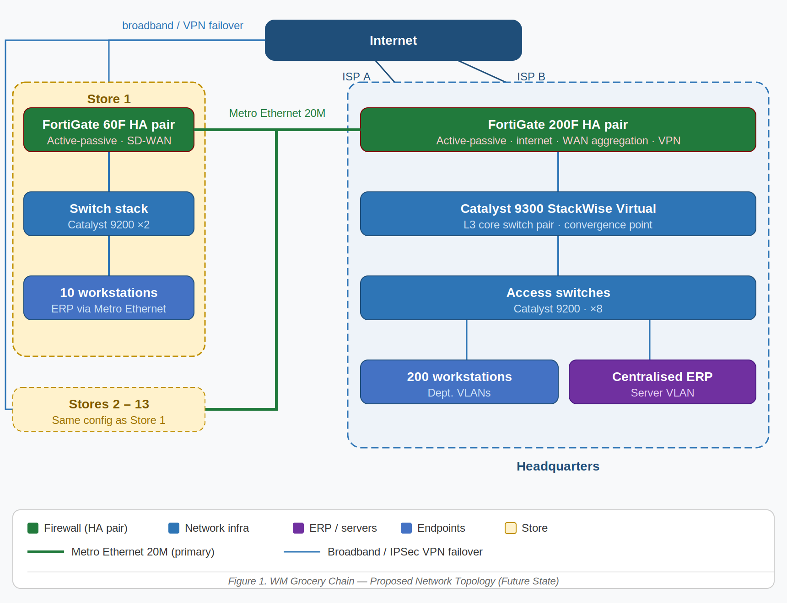

# Grocery Chain Network Design

# Overview

This repository presents the network design plan for WM, a fictional grocery chain undergoing significant expansion. WM currently operates one headquarters (HQ) and three retail stores, each interconnected via dedicated wide area network (WAN) links. The existing infrastructure has no redundancy for network equipment, creating single points of failure across all sites. To support a planned growth of ten additional stores over the next five years and to address these reliability gaps, WM requires a scalable, resilient, and secure network infrastructure.

This document outlines the proposed design including network topology, equipment selection, IP addressing scheme, and implementation considerations. The design focuses on high availability by eliminating single points of failure at both HQ and store locations. Firewall redundancy is provided through FortiGate HA clusters at all sites. Network redundancy is provided through redundant Catalyst 9300 core switches at HQ and redundant switching infrastructure within stores. WAN redundancy is achieved through dual-path connectivity using Metro Ethernet and broadband VPN services. In the event of a firewall, switch, ISP, WAN circuit, or device failure, network services remain available with automatic failover and minimal disruption to business operations.

# Background

## Current State

WM is a grocery chain which currently operates the following infrastructure:

- One headquarters (HQ) with 50 workstations
- Three retail stores, each with 10 workstations
- An ERP system with core servers located at HQ and two local servers at each store
- Daily server synchronization between HQ and each store
- Each store connected to HQ via a 2 Mbps dedicated WAN link
- All workstations at HQ and each store have Internet access
- No redundancy for network equipment — a single point of failure exists at both HQ and each store

## Future Requirements

WM plans to expand significantly over the next five years:

- Addition of ten new retail stores, bringing the total to thirteen stores
- Growth of HQ workstations from 50 to 200
- Each new store will have 10 workstations, consistent with existing stores
- Upgraded network to improve capacity, reliability, and redundancy across all locations

# Network Design

## Topology

A Hub-and-Spoke (Star) topology is recommended for WM's network. The HQ serves as the central hub, with all stores connecting back to HQ as spokes. This design aligns with WM's centralized ERP model, with all ERP services hosted at HQ and accessed in real time by stores over the Metro Ethernet WAN circuits.

**WAN Links:** Each store connects to HQ via a 20 Mbps Metro Ethernet WAN service as the primary link, upgraded from the 2 Mbps dedicated connection. This increased bandwidth enables real-time ERP access and eliminates the need for local ERP servers at branch locations. Each store also maintains a broadband Internet connection that serves two purposes: direct Internet access for store workstations and a secondary IPSec VPN tunnel to HQ. Under normal operation, all ERP transactions, authentication, and corporate application traffic traverse the Metro Ethernet WAN circuit, while general Internet traffic uses the local broadband connection. If the primary WAN circuit fails, SD-WAN automatically redirects corporate traffic through the IPSec VPN tunnel over broadband, maintaining uninterrupted connectivity to HQ. SD-WAN policies continuously monitor link health and enforce traffic prioritization to ensure ERP and business-critical applications maintain performance during congestion or failover scenarios.

**HQ Network:** A redundant core layer consisting of a FortiGate 200F HA firewall cluster and dual Cisco Catalyst 9300 Layer 3 switches ensure high availability. The Catalyst 9300 switch pair, configured as a StackWise Virtual domain, serves as the central convergence point for all HQ network traffic. The FortiGate 200F HA pair functions as both the Internet perimeter security gateway and the WAN aggregation point for all store connections. Primary Metro Ethernet WAN circuits from stores terminate on the FortiGate cluster, which routes traffic directly to the Catalyst 9300 core. The firewall cluster also terminates the broadband IPSec VPN failover tunnels from stores and enforces security policies for all Internet-bound traffic. The 200 HQ workstations are segmented into VLANs by department. HQ servers reside on a dedicated server VLAN isolated from workstation traffic. Firewall failover, switch redundancy, and dual ISP connections eliminate single points of failure within the HQ network.

**Store Network:** Each store is equipped with a FortiGate 60F HA pair operating in active-passive mode to provide redundant routing, firewall, VPN, and SD-WAN services. The store network connects 10 workstations and standard retail systems. Following the WAN upgrade, branch-local ERP servers have been removed, and all ERP services are now fully centralized at HQ. The FortiGate 60F HA pair performs inter-VLAN routing and manages connectivity to HQ through both the primary Metro Ethernet WAN circuit and the secondary broadband connection.

## Equipment Selection

### Headquarters Main Network Equipment

| **Device** | **Model (Example)** | **Quantity** | **Purpose** |
| --- | --- | --- | --- |
| Core Switch (L3) | Cisco Catalyst 9300 | 2 | Core switching and VLAN routing (stacked) |
| Access Switch (L2) | Cisco Catalyst 9200 | 8 | Workstation connectivity |
| Firewall | Fortinet FortiGate 200F | 2 | Internet perimeter security, WAN aggregation for all store Metro Ethernet circuits, and IPSec VPN termination for broadband failover tunnels (HA active-passive pair) |

### Store Main Network Equipment (Per Store)

| **Device** | **Model (Example)** | **Quantity** | **Purpose** |
| --- | --- | --- | --- |
| Access Switch | Cisco Catalyst 9200 | 2 | Workstation connectivity (stacked) |
| Firewall/UTM | Fortinet FortiGate 60F HA pair | 2 | Redundant routing, firewall, VPN and SD-WAN services; inter-VLAN routing; Metro Ethernet and broadband WAN management (active-passive HA) |

## IP Scheme

Subnets are allocated by site and function to simplify management, access control, and troubleshooting. VLSM (Variable Length Subnet Masking) is used to minimize address waste.

The overall address block 10.0.0.0/8 is allocated to WM's private network, subdivided as follows:

### HQ — IP Address Allocation

| **Site / VLAN** | **Network Block** | **Subnet Mask** | **Hosts** | **Purpose** |
| --- | --- | --- | --- | --- |
| HQ — Management (VLAN 10) | 10.0.1.0/24 | 255.255.255.0 | 254 | Network devices, servers |
| HQ — Finance (VLAN 20) | 10.0.2.0/24 | 255.255.255.0 | 254 | Finance dept. workstations |
| HQ — Operations (VLAN 30) | 10.0.3.0/24 | 255.255.255.0 | 254 | Operations workstations |
| HQ — IT (VLAN 40) | 10.0.4.0/24 | 255.255.255.0 | 254 | IT workstations and lab |
| HQ — General (VLAN 50) | 10.0.5.0/24 | 255.255.255.0 | 254 | Remaining HQ workstations |
| HQ — Servers (VLAN 60) | 10.0.6.0/24 | 255.255.255.0 | 254 | Centralized ERP system, NAS, DNS servers |
| HQ — DMZ (VLAN 70) | 10.0.7.0/24 | 255.255.255.0 | 254 | Internet-facing services |

### Stores — IP Address Allocation

| **Site / VLAN** | **Network Block** | **Subnet Mask** | **Hosts** | **Purpose** |
| --- | --- | --- | --- | --- |
| All Stores (1–13) | 10.1.1–13.0/24 | 255.255.255.0 | 254 | One /24 per store, sub-divided — see rows below |
| ↳ Management (VLAN 101–113) | 10.1.x.0/26 | 255.255.255.224 | 62 | Router, switch, firewall, APs |
| ↳ Workstations (VLAN 201–213) | 10.1.x.64/26 | 255.255.255.192 | 62 | Store workstations (10 current, room to grow) |
| ↳ Reserved | 10.1.x.128/25 | 255.255.255.128 | 126 | Future VLANs (e.g. guest WIFI, POS terminals) |

### WAN — IP Address Allocation

| **Site / VLAN** | **Network Block** | **Subnet Mask** | **Hosts** | **Purpose** |
| --- | --- | --- | --- | --- |
| WAN Links — HQ P2P | 10.255.0.0/24 | 255.255.255.252 (/30) | 2 per link | HQ-to-store Metro Ethernet links |

# Routing Protocol

WM's network uses a combination of SD-WAN policy-based routing at store branches and OSPF within HQ, ensuring efficient traffic steering under normal conditions and automatic failover across both WAN paths.

- Store branches: SD-WAN policy routing via FortiGate 60F HA pair — Metro Ethernet for corporate traffic, broadband for Internet; automatic failover to IPSec VPN over broadband if Metro Ethernet fails.
- HQ core (FortiGate 200F HA pair and Catalyst 9300 StackWise Virtual): OSPF Area 0, dynamic route exchange for automatic failover path detection.
- Store subnets advertised into OSPF by the FortiGate 200F via Metro Ethernet interfaces (primary) or VPN interfaces (failover); the Catalyst 9300 selects the best path automatically.
- Internet default route: advertised into OSPF by the FortiGate, providing HQ devices with a gateway of last resort for internet-bound traffic.

# Security Considerations

- **VPN Tunnels:** The primary Metro Ethernet WAN circuit between each store and HQ is a private managed service and does not require VPN encryption. IPSec site-to-site VPN tunnels are established over each store's broadband Internet connection, providing an encrypted failover path to HQ should the primary WAN circuit become unavailable. VPN tunnels are terminated at the store by the FortiGate 60F HA pair and at HQ by the FortiGate 200F HA pair.
- **Firewall Policies:** Strict firewall rules limit store-to-store communication; all inter-site traffic must pass through HQ.
- **Network Segmentation:** VLANs at HQ isolate departments, reducing the blast radius of any security incident.
- **Internet Access:** Store workstations access the Internet directly via the local broadband connection, inspected by the FortiGate 60F HA pair before egress. HQ Internet traffic is inspected by the FortiGate 200F HA pair. Centralized URL filtering and threat intelligence policies are pushed to all branch FortiGate devices from HQ to ensure a consistent security posture across all sites.
- **Wireless Security:** WPA3-Enterprise with 802.1X authentication is used at HQ; WPA3-Personal with a strong passphrase at stores.

# Implementation Roadmap

| **Phase** | **Timeline** | **Activities** |
| --- | --- | --- |
| Phase 1 — HQ Upgrade | Months 1–3 | Deploy FortiGate 200F HA firewall cluster and Catalyst 9300 StackWise Virtual core switches at HQ; implement VLAN segmentation; expand HQ to 200 workstations; configure dual ISP connections; eliminate single points of failure |
| Phase 2 — Existing Store Upgrades | Months 3–5 | Upgrade existing store WAN links from 2 Mbps to 20 Mbps Metro Ethernet; remove local ERP servers from existing stores; deploy FortiGate 60F HA pairs at existing stores; provision broadband connections; configure SD-WAN policies and IPSec VPN failover tunnels |
| Phase 3 — New Store Deployments | Months 6–60 | Staged rollout of 10 new stores (~1 store/quarter), each with standardized equipment and IP allocation |
| Phase 4 — Optimization | Ongoing | Performance monitoring, QoS tuning for ERP traffic, review and adjust capacity as needed |
